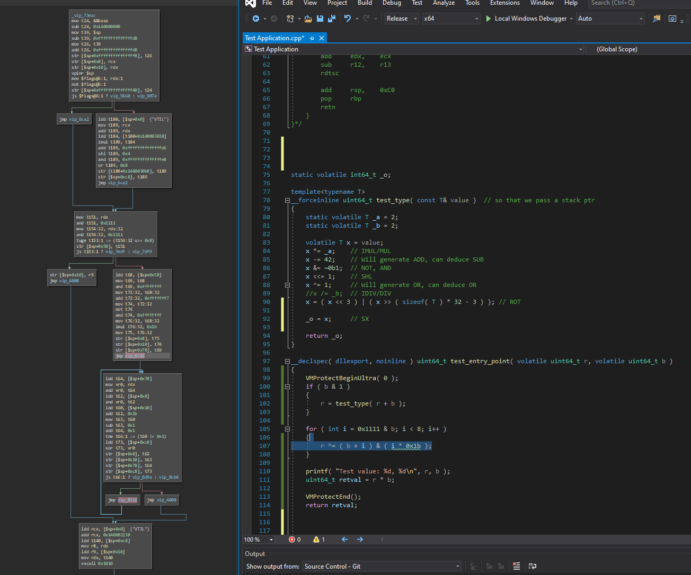

# VTIL-BinaryNinja
A Binary Ninja plugin for loading and analyzing VTIL routines as a native BinaryView, with LLIL lifting for the VTIL instruction set.

VTIL (Virtual-machine Translation Intermediate Language) is a project and set of tools used for binary deobfuscation and devirtualization.

**Input format:** This plugin consumes separate VTIL files (files with `VTIL` magic at offset 0), not raw executables directly.

## Do I Need This Plugin?
You probably want this plugin if:
- You already have separate VTIL routine files and want to inspect them in Binary Ninja
- You want CFG-aware navigation and LLIL lifting for VTIL instructions
- You want to use Binary Ninja analysis workflows on recovered VTIL code

You probably do not need this plugin if:
- You do not currently produce VTIL files in your workflow
- You are looking for automated deobfuscation/devirtualization from raw binaries in this plugin alone

## What It Does / Does Not Do
What it does:
- Loads VTIL binary files into a custom BinaryView
- Creates function/label symbols for VTIL blocks
- Lifts VTIL instructions into LLIL for analysis in Binary Ninja
- Provides control flow mapping for `js`, `jmp`, `vexit`, `vxcall`

What it does not do (yet):
- This is still an early proof of concept; expect rough edges
- Runtime semantics should still be validated on real samples
- It does not generate VTIL from binaries; it consumes VTIL files

## Installation
Install via the Plugin Manager in Binary Ninja, or clone this repository into your [plugin folder](https://docs.binary.ninja/guide/plugins.html#using-plugins).

## Python Requirements
For local development installs, use [requirements.txt](requirements.txt).

## Lifting Coverage
Implemented LLIL coverage includes all VTIL-Core instructions (49/49):
- Control flow: `js`, `jmp`, `vexit`, `vxcall`
- Data/memory: `mov`, `movsx`, `str`, `ldd`
- Arithmetic core: `neg`, `add`, `sub`, `mul`, `mulhi`, `imul`, `imulhi`, `div`, `idiv`, `rem`, `irem`
- Bitwise core: `popcnt`, `bsf`, `bsr`, `not`, `shl`, `shr`, `xor`, `or`, `and`, `rol`, `ror`
- Conditionals: `te`, `tne`, `tg`, `tge`, `tl`, `tle`, `tug`, `tuge`, `tul`, `tule`, `ifs`
- Special instructions currently map to no op IL: `nop`, `sfence`, `lfence`, `vemit`, `vpinr`, `vpinw`, `vpinrm`, `vpinwm`

Validation helper:
- Run `python tools/validate.py /path/to/VTIL-Core` to verify instruction table sync.

## Sample References
For sample routines, use the upstream VTIL repositories directly:
- https://github.com/vtil-project/VTIL-Core/tree/master/Sample%20Routines
- https://github.com/vtil-project/VTIL-Samples/

## Screenshots

## Disclaimer
This is a **very early proof of concept**. Expect bugs.

Known issues:
- Special instructions (`nop`, `sfence`, `lfence`, `vemit`, `vpinr`, `vpinw`, `vpinrm`, `vpinwm`) intentionally lower to no op IL
- Runtime semantics should still be validated on real world samples because this plugin remains a proof of concept.
